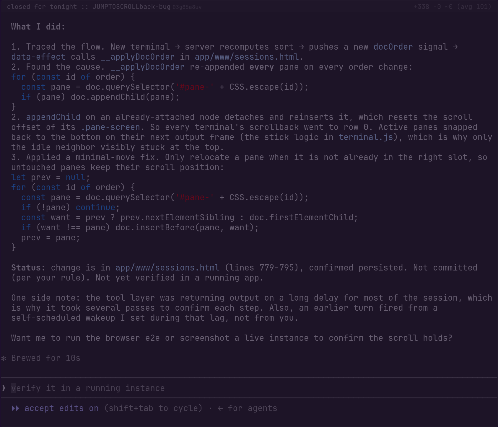
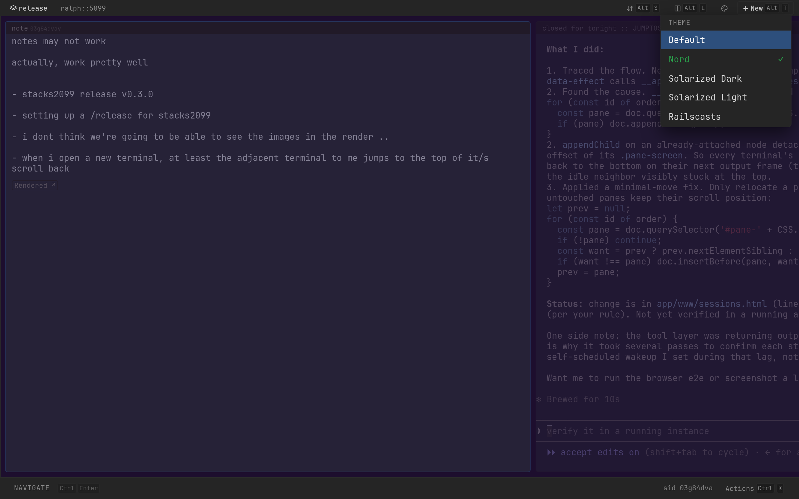

# stacks2099

[Stacks](https://stacks.cross.stream) is a tool for thought: a collection of
**stacks** of **clips** for managing your personal context. A **clip** is any
byte sequence with a mime type -- a note, an image, a JSON blob, a screenshot, a
README. Clips gather into **stacks**, one per task or train of thought.

stacks2099 is that thesis, expanded. The original
[stacks](https://github.com/cablehead/stacks) ran on a crude event stream and a
throwaway first-draft UI. Its event stream was spun out and matured into
[cross.stream](https://github.com/cablehead/xs)
([stacks#46](https://github.com/cablehead/stacks/issues/46)); the UI it was
missing arrived as [Datastar](https://data-star.dev)
([stacks#58](https://github.com/cablehead/stacks/issues/58)). stacks2099 is
stacks rebuilt on both.

It also widens what a clip can be. Besides notes and images, a clip can be a
running terminal or an embedded URL, so a stack holds the working context itself
-- the shells you're in, the site you're building. The page is a pure projection
of the event log: layout and the visible HTML are computed on the server and
patched over Datastar SSE (the per-tab cursor is the one bit the client owns).
Terminals included, rendered from
[wezterm-term](https://github.com/wezterm/wezterm) as
[an HTML grid (no WASM, no client-side VT emulator)](journey.md).



## Install

Each release ships prebuilt binaries for macOS (Apple Silicon), Linux (x86_64),
and Windows (x86_64).

### [eget](https://github.com/zyedidia/eget)

Grabs the right binary for your platform from the latest release:

```bash
eget cablehead/stacks2099
```

### Homebrew (macOS)

```bash
brew install cablehead/tap/stacks2099
```

### Direct download

Pick an archive from the
[releases](https://github.com/cablehead/stacks2099/releases) page; the binary
sits at the root.

### cargo

Not published to crates.io. Install from git, or build a checkout:

```bash
cargo install --git https://github.com/cablehead/stacks2099
# or, in a clone:
cargo build --release      # -> target/release/stacks2099
```

The binary is self-contained -- the app (Nushell handler, assets, fonts) and the
Nushell engine, store, and Datastar bundle are all baked in. There is no
external `nu` to install and nothing fetched from a CDN at runtime.

## Run

You choose where it listens (`ADDR`) and where its state lives (`--store`); both
are required.

```bash
stacks2099 127.0.0.1:5099 --store ./store      # runs the app baked into the binary
```

For development, `--dev` runs the app (`app/serve.nu` + `app/www`) straight from
the source tree with hot-reload -- edit the request closure, the `sessions.html`
template, CSS, or JS and refresh; no Rust rebuild:

```bash
cargo run -- --dev 127.0.0.1:5099 --store ./dev-store
```

Only changing the Rust (the pty projection, new builtins) needs `cargo build`.

### App lives in the store

On a non-`--dev` launch the binary unpacks its baked-in app (`serve.nu`,
`render.nu`, `www/`, fonts) into `<store>/app/` and serves it from there. The
app travels with the store it serves, not a shared per-user cache, so each store
carries its own copy.

This lets different stores run different versions of the app. Point an older
binary at one store and a newer binary at another, and each serves the app it
shipped with. The unpack overwrites on every launch, so a store always reflects
the binary that last opened it; to pin a store to a version, keep opening it with
that binary.

To hack on the app for one store without rebuilding, edit the files under
`<store>/app/` directly. The next non-`--dev` launch overwrites them, so copy
lasting changes back into the source tree (or use `--dev`, which serves from
source and never unpacks).

### Terminal limit over HTTP/1.1

Each live terminal holds its own streaming connection. Browsers cap concurrent
connections per origin at roughly 6 over HTTP/1.1, so once you open about that
many terminals the next connection (including the POSTs that carry your
keystrokes) has nowhere to go and queues. All input freezes.

To recover, close a terminal through the server API to free a connection. Get a
clip id from `curl localhost:5099/api/state`, then:

```bash
curl -X POST 'localhost:5099/clip/close?clip=<CLIP_ID>'
```

Serving over HTTP/2 sidesteps this -- a single connection multiplexes every
stream, so the per-origin cap never bites. Run with `--tls` (browsers negotiate
HTTP/2 only over TLS) and the limit is gone. The planned fix multiplexes the
whole interface over a single `/sse` connection so plain HTTP/1.1 stops being a
ceiling.

## Model

Clips, stacks, and the window title are frames in an append-only
[cross.stream](https://cross.stream) log; the page is a pure projection of that
log, and a restart replays it. Each stack is its own page (`/stack/<id>`), and
its `/sse` stream is scoped to that stack. The **cursor** (which clip is
focused) is client-owned per tab -- not a logged frame -- so two tabs browse
independently. The UI is three columns: **stacks** | **clips** | **content**
(the current stack's clips, stacked top to bottom).

- A **clip** is any byte sequence with a mime type, rendered by what it is: an
  editable **note** (`text/*`), an inline **image** (`image/*`), a live
  **terminal**, a live **embed** (a URL in an `<iframe>`), or -- for anything
  else -- a read-only / downloadable preview. An unknown mime type still holds
  and previews; rendering it nicely is a later add, not a prerequisite.
- **View and focus are independent.** A clip's **view** is how it displays --
  markdown cycles raw ⇄ rendered (`mod+K v`); a `text/uri-list` clip shows as a
  live iframe. **Focus** (`mod+Enter`) is separate: it hands the keyboard to the
  clip's input target as if it were the only thing on the page -- a terminal's
  pty, or a text clip's source editor. Focusing an editable clip opens its source
  over whatever view was showing; unfocusing returns to that view (rendered stays
  rendered).
- A **stack** groups clips into a context. The top-left **breadcrumb** names the
  current stack and opens a switcher to jump between stacks or create one (`mod+K
  g`; `mod+K [` / `]` cycle). It stays reachable when the scrollable layout hides
  the rail.
- Clips order **`auto`** (by activity -- newest edits float up) or **`manual`**
  (curated). The clips-header badge toggles the mode; `mod+K` then `J`/`K` moves
  the selected clip down/up (the first move freezes the current order into
  `manual`).
- Each stack picks a **layout**: `flow` (a vertical column of panes) or `niri`
  (a horizontal scrollable strip). The top-bar Layout button or `mod+K l`
  toggles it.
- **Terminal clips** bind to an embedded-Nushell pty. The binary re-execs itself
  to run the shell, so there is no external `nu` to find, and placement survives
  a restart -- the pty respawns where it was, zellij-style.

The top bar carries the stack breadcrumb (the switcher handle) and the **Theme**
button, which swaps the terminal palette (client-side: Default, Nord, Solarized,
Railscasts, and friends). Sort, Layout, and New live under the `mod+K` leader.



## Add assets

Paste an image into the page (`Cmd`/`Ctrl+V`) to drop it into the current stack.
From the command line, POST any asset to the running server:

```bash
# mime from the Content-Type header; lands in the current stack; prints the clip id
curl --data-binary @diagram.png -H 'content-type: image/png' localhost:5099/clip/add
cat notes.md | curl --data-binary @- -H 'content-type: text/markdown' localhost:5099/clip/add
curl --data-binary @logo.svg -H 'content-type: image/svg+xml' 'localhost:5099/clip/add?stack=design'
```

Embed a live URL (e.g. a dev server you're watching) as an iframe clip:

```bash
echo http://localhost:3000 | curl --data-binary @- -H 'content-type: text/uri-list' localhost:5099/clip/add
```

Re-post to an existing clip to replace its bytes -- its pane refreshes in place,
so a regenerated asset updates live:

```bash
curl --data-binary @diagram.png 'localhost:5099/clip/update?clip=<id>'
```

`?stack=` takes a stack id or name; omit it for the current stack. `/api/state`
lists the stacks (ids, names, clip counts) for scripting.

## API and events

The HTTP routes are thin wrappers: each appends a frame to the log. The store
serves an `xs` API on its socket, so you can write the same frames yourself; the
API is just sugar over the event log. (The cursor is the exception -- it is
client-owned per tab and never hits the log; `/nav` only persists a best-effort
"focused clip" pointer for `/api/state` and reconnect landing.)

```bash
# add a markdown clip via the HTTP API
curl --data-binary @notes.md -H 'content-type: text/markdown' localhost:5099/clip/add

# the identical effect, appended straight to the log with the xs client
# (STACK_ID from `curl localhost:5099/api/state`):
cat notes.md | xs append ./store clip.add --ttl forever \
  --meta '{"stack_id":"STACK_ID","kind":"content","mime_type":"text/markdown"}'
```

In a store-connected Nushell (`xs` gives you one) the builtin form is
`<body> | .append <topic> --meta {...}` -- exactly what each route runs.

| Action        | HTTP                            | Frame appended                                   |
| ------------- | ------------------------------- | ------------------------------------------------ |
| New stack     | `POST /stack/new`               | `stack.add {sort}`                               |
| Rename stack  | `POST /stack/rename`            | `stack.update {id, name}`                        |
| Delete stack  | `POST /stack/close?stack=`      | `stack.delete {id}`                              |
| Add clip      | `POST /clip/add`                | `clip.add {stack_id, kind, mime_type}` + body    |
| Update clip   | `POST /clip/update?clip=`       | `clip.update {id}` + body                        |
| Rename clip   | `POST /clip/label?clip=&label=` | `clip.patch {id, label}`                         |
| Set view      | `POST /clip/view?clip=&view=`   | `clip.patch {id, view}`                          |
| Close clip    | `POST /clip/close?clip=`        | `clip.delete {id}`                               |
| Move clip     | `POST /clip/move?dir=&clip=`    | `clip.patch {id, position}` (renumber on freeze) |
| Toggle sort   | `POST /stack/sort?stack=`       | `stack.update {id, sort}`                        |
| Toggle layout | `POST /stack/layout?stack=`     | `stack.update {id, layout}`                      |
| Switch stack  | navigate to `/stack/<id>`       | (the URL is the stack; a fresh `/sse?stack=`)    |
| Move cursor   | `POST /nav` (best-effort)       | persists focused clip; cursor is client-owned    |

The topics and fields _are_ the protocol -- defined in `app/projection.nu`.
Terminal clips are the exception: their pty is spawned by a `POST` to
`/clip/new?type=terminal`, so create those through the API.

`POST /stack/new` answers a browser with a redirect to the new stack's page. A
scripted caller that sends `Accept: application/json` gets `{id}` instead, no
redirect to scrape. (`POST /clip/add` already returns the new clip id as plain
text.)

## Keys

Two modes. **Navigate** browses (read-only, dimmed); **focus** drives the
selected pane (a terminal gets your keystrokes, a note opens its editor). A
focused clip owns every key except `mod+K` (and `mod+Enter` to leave), so
international keyboards type cleanly into the terminal: composed characters
(`|`, `~`, `\`), and dead-key / IME composition (macOS Option+e e -> an accented
char) reach the pty via a hidden input. See
[docs/adr/0005-mode-projected-keymap.md](docs/adr/0005-mode-projected-keymap.md).

**Focus.** `Enter` (or `mod+Enter`) focuses the selected clip; `mod+Enter`
leaves. `mod` is Cmd on macOS, Ctrl elsewhere.

**Navigate** (read-only browsing):

| Key                   | Action                  |
| --------------------- | ----------------------- |
| `j` / `k`             | Next / previous clip    |
| `Shift+J` / `Shift+K` | Move clip down / up     |
| `Enter`               | Focus the selected clip |

**The `mod+K` leader** (works in any mode, even over a focused terminal). `mod+K`
then a letter runs a command; pausing opens the actions panel as a which-key
cheatsheet (`mod+K` again, or `Esc`, closes it). See
[docs/adr/0008-leader-keymap.md](docs/adr/0008-leader-keymap.md).

Clip:

| Chord            | Action                    |
| ---------------- | ------------------------- |
| `mod+K` then `j` | Next clip                 |
| `mod+K` then `k` | Previous clip             |
| `mod+K` then `v` | View style (raw/rendered) |
| `mod+K` then `r` | Rename clip               |
| `mod+K` then `d` | Delete clip               |
| `mod+K` then `o` | Cycle terminal height     |
| `mod+K` then `J` | Move clip down            |
| `mod+K` then `K` | Move clip up              |

Stack:

| Chord                  | Action                      |
| ---------------------- | --------------------------- |
| `mod+K` then `n`       | New clip (note / terminal)  |
| `mod+K` then `N`       | New stack                   |
| `mod+K` then `R`       | Rename stack                |
| `mod+K` then `s`       | Toggle sort (auto / manual) |
| `mod+K` then `l`       | Toggle layout (flow / niri) |
| `mod+K` then `[` / `]` | Previous / next stack       |
| `mod+K` then `g`       | Switch stack (switcher)     |

The top bar carries the stack breadcrumb and the Theme button; the status bar
shows the active mode.

## Built on

A fork of [http-nu](https://github.com/cablehead/http-nu) -- one self-contained
binary embedding the [Nushell](https://www.nushell.sh) engine, the
[cross.stream](https://github.com/cablehead/xs) (`xs`) event log, and the
[Datastar](https://data-star.dev) bundle. Clips and request handlers are
Nushell; the app leans on a handful of builtins:

- `pty open` / `pty view` -- terminals, modelled by
  [wezterm-term](https://github.com/wezterm/wezterm) and projected to an HTML
  cell grid.
- `.cat` / `.append` / `.cas` -- the `xs` event log this fork is built around.
  `.bus` (pub/sub) is http-nu's own in-process event bus, not xs.
- `.mj` ([minijinja](https://github.com/mitsuhiko/minijinja)) for templates,
  `.highlight` ([syntect](https://github.com/trishume/syntect)) for syntax
  highlighting, `.md`
  ([pulldown-cmark](https://github.com/pulldown-cmark/pulldown-cmark)) for
  markdown.

## Status

Experimental, moving fast. Interfaces and the event protocol are not stable.
