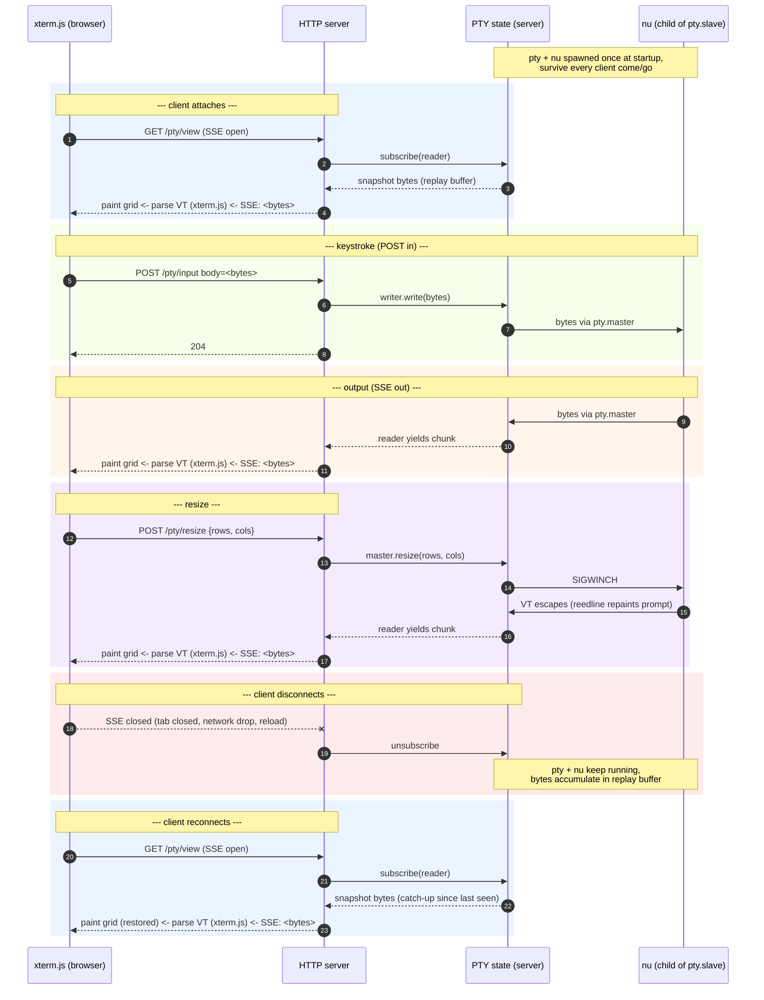
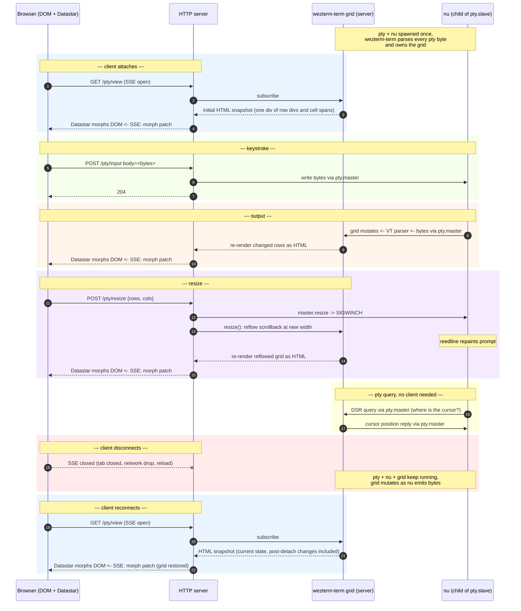

stacks2099 doesn't have a terminal emulator in the browser. The pty
runs on the server, where stacks2099 (our custom binary) drives
wezterm-term as a library to parse its bytes into a cell grid, the grid
renders to HTML, Datastar morphs it into the DOM. This is how I got
there.

Thanks to Benny for the prompt that turned this from a [Datastar
Discord](https://discord.gg/bnRNgZjgPh) answer into a doc.

https://github.com/user-attachments/assets/3a1d739d-2e56-41a4-a562-f05af1a770b2

## xterm.js plus a pty proxy, no buffer

This is the pretty standard starting place for sticking a terminal in a
web page. It's where I started, anyway. xterm.js on the client side -- a
virtual terminal emulator that knows how to parse the byte sequences a
terminal exchanges with the shell (or TUI) on the other end of the pty.
The server holds the pty, proxies bytes over HTTP in both directions --
bytes that would normally just go directly between the terminal and the
shell.

This actually works pretty great out of the box. The shape, drawn out:

Step 3 -- the snapshot bytes from a replay buffer -- doesn't exist
here yet. So on reconnect, what does your fresh xterm.js see? It
hasn't seen the history of bytes that the previous xterm.js parsed to
paint its virtual grid of what the screen looks like. You get a blank
screen. You press a key, that sends bytes through the pty to the
shell, the shell echoes your key back, you see a single keypress on
the screen. You might need to do a clear, cat a few things, start
building up a history of new bytes to get the virtual screen repainted
into something coherent.

## Adding a replay buffer

So my next step was wire up step 3 -- buffer the most recent bytes
sent to the terminal (the bytes that paint "l" and "s", the cursor
moves around them like newlines and carriage returns, and any escape
codes). On reconnect xterm.js sees a blast of bytes, replays them,
hopefully repaints to a coherent screen.

This worked "pretty" well. But pretty quickly the terminal would get
into a weird state. Pressing a key would delete the previous row of
output on the screen. Type ls, you'd see the output for a flash, then
the screen would clear and you'd just see the prompt at the top of the
screen.

My hunch was the stream was getting out of sync. The replay buffer is
a ring buffer, so you're picking it up at some arbitrary point,
potentially halfway through an escape sequence.

## Three kinds of byte

Back to "paint l, paint s, newline, carriage return" from earlier -- a
useful simplification but it blurs what's in the stream. A terminal
byte stream is a mix of three kinds of byte.

- Printables: bytes (or UTF-8 sequences) that produce a character you'd
  see. Put the glyph at the cursor, advance the cursor.
- C0 controls: low-ASCII control bytes. LF (\x0A) drops the cursor down
  a row, CR (\x0D) jumps it to column 0, BS (\x08) backs it up one,
  BEL (\x07) rings the bell. These don't paint anything; they're cursor
  moves and side effects.
- Escape sequences: anything starting with \x1b. Most of the protocol
  lives here -- attribute changes (colours, bold), cursor jumps, clear
  screen, mode switches (alternate screen, mouse reporting), queries
  the program wants the terminal to answer.

## Terminal queries (DA, DSR, and friends)

Some of those escape sequences are queries -- the program asks the
terminal a question and waits for the answer. The common ones:

- DA1, "Primary Device Attributes" -- \x1b[c, "what kind of terminal
  are you?"
- DA2, "Secondary Device Attributes" -- \x1b[>c, "what version?"
- DSR, "Device Status Report" -- \x1b[6n is the one I see most,
  "where's the cursor right now?". The terminal writes back
  \x1b[<row>;<col>R.
- OSC queries -- \x1b]10;?\x07 asks for the foreground colour, \x1b]11
  for background, \x1b]4;<n>;? for palette entry n. Plus a growing
  family for cursor colour, clipboard, titles, capability negotiation.

How these work: the program writes the query into its stdout (the pty
slave). The terminal picks up the escape, builds a reply, writes it to
the pty master (which the program reads as stdin). The program blocks
on a read until the reply lands, or gives up on a timeout.

So far the only thing that knows how to answer is the browser. With a
browser attached, you're fine. Without one, the queries pile up with no
one to answer them.

## How does tmux do this?

At this point I went and read tmux's source.

tmux is itself a terminal emulator. The persistent "server" daemon
isn't proxying the shell's bytes out to your attached terminal --
it's parsing them. Every byte the shell writes to its pty gets consumed
by tmux's VT parser, which maintains an in-memory grid (chars +
attributes + colours) and a scrollback ring. Your attached terminal
never sees the shell's raw output -- only what tmux re-emits.

End to end:

    shell --bytes--> pty --bytes--> tmux VT parser --updates--> grid
                                                                  |
    attached term <--bytes-- tmux VT renderer <--reads-- grid <---+

When you detach, the right half disappears; the left half keeps
running. The shell writes bytes, tmux parses, the grid mutates, nobody's
watching. When you reattach, tmux walks its grid and emits a fresh
escape sequence to paint that grid on whatever client showed up.

tmux isn't storing the bytes the shell wrote yesterday. It's storing
the result of those bytes -- the grid -- and regenerating bytes on
demand to reproduce it.

## A small VT100 proxy on the server

So then it was like, OK, we need something on the server that knows how
to parse the stream of bytes, so we can at least frame the replay. I
dropped the vt100 crate on the server. Bytes were tee'd to it so it
built up a virtual screen grid. On reconnect, push that screen to the
client, then start feeding it fresh bytes from nu so it could maintain
its grid incrementally from there.

Two jobs:

1. Holds a current grid so reconnect ships an actual screen state
   instead of a byte replay.
2. Handles pty queries (DA/DSR/OSC) when no client is attached.

(Around this time ghostty-web became pretty stable / usable, so
xterm.js got swapped out for it on the client -- drop-in replacement,
not an architectural change.)

This worked a good bit better. But would still fall into inconsistent
states.

## Swapping vt100 for wezterm-term

vt100 is an OK virtual terminal lib but doesn't handle a lot of what
ghostty does (mouse modes, OSC 8 hyperlinks, color queries, image
protocols). What I was after was parity with ghostty, and I was worried
the gaps would mean the two emulators would disagree too often. So I
swapped vt100 for wezterm. wezterm-term had the nicest API of the
options I looked at, and would presumably disagree with ghostty less
than vt100 did.

That was a good bit better again.

## Projecting the grid

But then I was like: why have 2x production-grade emulators?

Using Datastar for a good while at this point should be credited. Why
not maintain the screen grid only on the server, right next to the pty,
and as it changes render the screen state as HTML and use Datastar to
morph it into place.

Since switching to this I haven't ended up with a session in what feels
like a corrupted state.

The current shape:

